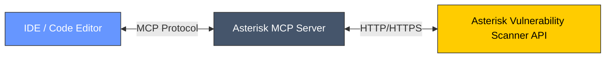

# Asterisk MCP Server

A Model Context Protocol (MCP) server that provides security scanning capabilities for code snippets, codebases, and verification of code changes.

## Overview

Asterisk MCP Server is a middleware component that connects to the Asterisk security API to provide real-time security analysis of code. It implements the Model Context Protocol (MCP) to expose security scanning tools to AI assistants like Claude, Cursor, Cline, Windsurf, etc. enabling them to analyze code for security vulnerabilities.

## Architecture



## Features

- **Code Snippet Scanning**: Analyze individual code snippets for security vulnerabilities
- **Codebase Scanning**: Scan multiple files for security issues with accurate context coverage
- **Change Verification**: Verify if code changes in your chat history introduce security vulnerabilities
- **Beautiful Settings UI**: Configure the server through a graphical interface
- **Flexible Transport**: Support for stdio and SSE transport protocols
- **Comprehensive Logging**: Detailed logging with configurable verbosity

## Requirements

- Python 3.10+
- pipx / uvx
- httpx
- mcp[cli]
- dearpygui (for settings UI)

## Usage
```
{
  "mcpServers": {
    "asterisk-mcp": {
      "command": "pipx run asterisk-mcp-server",
      "args": [
        "--api-url",
        "http://api.mcp.asterisk.so",
        "--transport",
        "stdio",
        "--key",
        "YOUR_API_KEY"
      ],
    }
  }
}
```

### Configuration

Configuration can be provided through command-line arguments or the settings UI:

#### API Server Settings

- `--api-url`: Base URL for the Asterisk API server
- `--key`: API key for authentication (required for API access)
- `--timeout`: Timeout for API requests in seconds (0 for no timeout)

#### MCP Server Settings

- `--server-name`: Name of the MCP server
- `--transport`: Transport protocol for the MCP server (stdio or sse)
- `--port`: Port for the SSE server (used with --transport sse)

#### Logging Settings

- `--log-level`: Logging level (DEBUG, INFO, WARNING, ERROR, CRITICAL)
- `--no-console`: Disable console output (only log to file)

## Available Tools

### scan_snippet

Scans individual code snippets for security vulnerabilities.

### scan_codebase

Scans multiple files for security issues.

### verify

Verifies if code changes introduce security vulnerabilities.

### settings

Opens the settings UI when the user enters "/asterisk".

## Data Flow

1. The IDE or code editor sends a request to the Asterisk MCP Server using the MCP protocol
2. The MCP server processes the request and forwards it to the Asterisk Vulnerability Scanner API
3. The API analyzes the code and returns security findings
4. The MCP server formats the results and returns them to the IDE/editor
5. The IDE/editor presents the security analysis to the user

## Troubleshooting

### Connection Issues

- Verify that the API URL is correct and accessible
- Check that your API key is valid and has not expired
- Ensure your network allows connections to the API server

### Authentication Errors

- Verify your API key is correctly set in the configuration
- Check that your API key has the necessary permissions
- Regenerate your API key from the dashboard if necessary

### Timeout Errors

- Increase the API timeout setting for large codebases
- Consider analyzing smaller portions of code separately
- Check your network connection stability

## License

This project is licensed under the Apache License, Version 2.0. See the LICENSE file in the repository for the full license text.

## Getting Help

- We're here to help! Reach out to us for any additional questions or assistance you might need at [hello@asterisk.so](hello@asterisk.so).
- Get your API key from [https://app.mcp.asterisk.so](https://app.mcp.asterisk.so)
