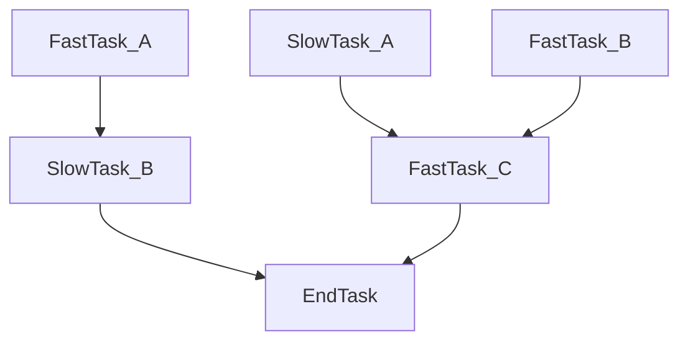

async-dag
---
A simple library for running complex DAG of async tasks.

### Use case example

Lets assume that you have the following task dependencies graph:


The optimal way to run this flow would be:

1) Run `FastTask_A`, `FastTask_B`, and `SlowTask_A` all at once,
2) as soon as `FastTask_A` ends, start executing `SlowTask_B`
3) as soon as `SlowTask_A` and `FastTask_B` ends, start executing `FastTask_C`
4) as soon as `SlowTask_B` and `FastTask_C` ends, start executing `EndTask`

Creating this flow in code isn't trivial and require managing tasks manually, and from my experience most people miss the performance benefits of starting to execute `SlowTask_B` as soon as possible
(because it's just easy to `gather(FastTask_A, SlowTask_A, FastTask_B)`).

This library provides a simple interface for creating the optimal execution path for async tasks that build a DAG.

#### Code example
```python
import asyncio
from typing import Awaitable, Callable

from async_dag import build_dag

# Helper functions to define our tasks

def define_one_arg_task(name: str, delay: float) -> Callable[[int], Awaitable[int]]:
    async def _task(n: int) -> int:
        print(f"{name} task started...")
        await asyncio.sleep(delay)
        print(f"{name} task done!")

        return n + 1

    return _task


def define_two_arg_task(
    name: str, delay: float
) -> Callable[[int, int], Awaitable[int]]:
    async def _task(a: int, b: int) -> int:
        print(f"{name} task started...")
        await asyncio.sleep(delay)
        print(f"{name} task done!")

        return a + b

    return _task


# Define the DAG
with build_dag(int) as tm:
    fast_task_a = tm.add_node(define_one_arg_task("fast_task_a", 0.1))
    slow_task_b = tm.add_node(define_one_arg_task("slow_task_b", 1), fast_task_a)

    slow_task_a = tm.add_node(define_one_arg_task("slow_task_a", 0.5))
    fast_task_b = tm.add_node(define_one_arg_task("fast_task_b", 0.1))
    fast_task_c = tm.add_node(
        define_two_arg_task("fast_task_c", 0.1), slow_task_a, fast_task_b
    )

    end_task = tm.add_node(define_two_arg_task("end_task", 0), fast_task_c, slow_task_b)


# Invoke the DAG
async def main():
    # prints:
    # fast_task_a task started...
    # slow_task_a task started...
    # fast_task_b task started...
    # fast_task_a task done!
    # fast_task_b task done!
    # slow_task_b task started...
    # slow_task_a task done!
    # fast_task_c task started...
    # fast_task_c task done!
    # slow_task_b task done!
    # end_task task started...
    # end_task task done!
    execution_result = await tm.invoke(0)

    # we can extract each node return value
    print(fast_task_a.extract_result(execution_result))  # 1
    print(end_task.extract_result(execution_result))  # 4


if __name__ == "__main__":
    asyncio.run(main())
```

#### Another code example

```python
import asyncio
from dataclasses import dataclass
from datetime import datetime

from async_dag import build_dag


@dataclass
class Event:
    timestamp: datetime
    location: str


class DatabaseClient:
    async def insert(self, event: Event) -> bool:
        # simulate async access to the database
        await asyncio.sleep(0.5)

        return True


class HttpClient:
    async def fetch(self, url: str) -> Event:
        # simulate async http request
        await asyncio.sleep(0.5)

        return Event(timestamp=datetime.now(), location=url)

    async def publish_logs(self, results: list[bool]) -> None:
        # simulate async http request
        await asyncio.sleep(0.5)


@dataclass
class Parameters:
    http_client: HttpClient
    db_client: DatabaseClient
    allowed_locations: str


async def fetch_event(url: str, params: Parameters) -> Event:
    # NOTE: we have access to the invoke params, http client for example
    return await params.http_client.fetch(url)


async def insert_to_db(event: Event, params: Parameters) -> bool:
    if event.location != params.allowed_locations:
        return False

    return await params.db_client.insert(event)


async def publish_results(result_1: bool, result_2: bool, params: Parameters) -> None:
    await params.http_client.publish_logs([result_1, result_2])


# NOTE: we don't have to request receive the Parameters argument, we can also request nodes that are not in the last batch
async def logger(
    event_1: Event, result_1: bool, event_2: Event, result_2: bool
) -> None:
    print(event_1, result_1, event_2, result_2)


with build_dag(Parameters) as tm:
    moon_url = tm.add_immediate_node("moon")
    moon_event = tm.add_node(fetch_event, moon_url)
    moon_insert = tm.add_node(insert_to_db, moon_event)

    sun_url = tm.add_immediate_node("sun")
    sun_event = tm.add_node(fetch_event, sun_url)
    sun_insert = tm.add_node(insert_to_db, sun_event)

    tm.add_node(publish_results, moon_insert, sun_insert)

    tm.add_node(logger, moon_event, moon_insert, sun_event, sun_insert)


async def main():
    http_client = HttpClient()
    db_client = DatabaseClient()

    # prints due to logger
    # Event(timestamp=datetime.datetime(2025, 3, 23, 16, 13, 55, 498349), location='moon') True Event(timestamp=datetime.datetime(2025, 3, 23, 16, 13, 55, 498361), location='sun') False
    first_result = await tm.invoke(Parameters(http_client, db_client, "moon"))

    # Event(timestamp=datetime.datetime(2025, 3, 23, 16, 13, 55, 498349), location='moon')
    # NOTE: the result of each node using the ExecutionResult object
    print(moon_event.extract_result(first_result))
    # True
    print(moon_insert.extract_result(first_result))

    # prints due to logger
    # Event(timestamp=datetime.datetime(2025, 3, 23, 16, 13, 57, 48707), location='moon') False Event(timestamp=datetime.datetime(2025, 3, 23, 16, 13, 57, 48717), location='sun') True
    # NOTE: we can use the same TaskGroup many times, there is no need to rebuild the DAG
    second_result = await tm.invoke(Parameters(http_client, db_client, "sun"))

    # Event(timestamp=datetime.datetime(2025, 3, 23, 16, 13, 57, 48707), location='moon')
    print(moon_event.extract_result(second_result))
    # False
    print(moon_insert.extract_result(second_result))


if __name__ == "__main__":
    asyncio.run(main())
```
