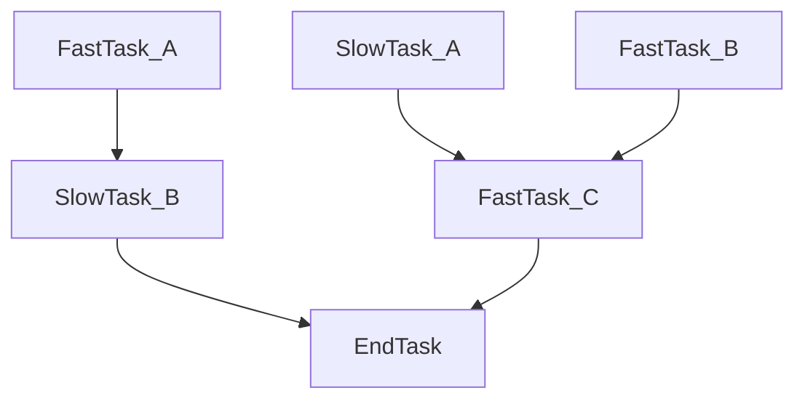

async-dag
---
A simple library for running complex DAG of async tasks.

### Use case example

Lets assume that you have the following task dependencies graph:


The optimal way to run this flow would be:

1) Run `FastTask_A`, `FastTask_B`, and `SlowTask_A` all at once,
2) as soon as `FastTask_A` ends, start executing `SlowTask_B`
3) as soon as `SlowTask_A` and `FastTask_B` ends, start executing `FastTask_C`
4) as soon as `SlowTask_B` and `FastTask_C` ends, start executing `EndTask`

Creating this flow in code isn't trivial and require managing tasks manually, and from my experience most people miss the performance benefits of starting to execute `SlowTask_B` as soon as possible
(because it's just easy to `gather(FastTask_A, SlowTask_A, FastTask_B)`).

This library provides a simple interface for creating the optimal execution path for async tasks that build a DAG.

#### Code example
```python
import asyncio

from async_dag import build_dag


async def inc_task(n: int, name: str, delay: float) -> int:
    print(f"{name} task started...")
    await asyncio.sleep(delay)
    print(f"{name} task done!")

    return n + 1


async def add_task(a: int, b: int, name: str, delay: float) -> int:
    print(f"{name} task started...")
    await asyncio.sleep(delay)
    print(f"{name} task done!")

    return a + b


# Define the DAG (O(N) operation, where n is the number of nodes in the DAG)
with build_dag(int) as tm:
    # Each node is made of an async function, and the parameters that will get passed to it at invoke time, a parameter can be either a value or another node.
    # We are serenely creating a partially applied async function, just like `functools.partial`.

    # tm.parameter_node is a spacial node that will get resolved into the invoke parameter (the value passed to `tm.invoke`)
    # you can also pass an immediate value to the node as a constant that will be the same across all invocations
    fast_task_a = tm.add_node(
        inc_task,
        tm.parameter_node,
        "fast_task_a",
        0.1,
    )

    # here we pass the result from fast_task_a as the n param to inc_task node
    slow_task_b = tm.add_node(
        inc_task,
        fast_task_a,
        "slow_task_b",
        1,
    )

    slow_task_a = tm.add_node(
        inc_task,
        tm.parameter_node,
        "slow_task_a",
        0.5,
    )
    fast_task_b = tm.add_node(
        inc_task,
        tm.parameter_node,
        "fast_task_b",
        0.1,
    )
    fast_task_c = tm.add_node(
        add_task,
        slow_task_a,
        fast_task_b,
        "fast_task_c",
        0.1,
    )

    end_task = tm.add_node(add_task, fast_task_c, slow_task_b, "end_task", 0.1)


# Invoke the DAG
async def main() -> None:
    # In order to execute our partially applied DAG we call `tm.invoke` and pass in the parameters, we can invoke the same DAG many times after we have fully built it.
    # each run returns an `ExecutionResult` which can be used to extract the return value of each node by calling `extract_result` on the node.

    # prints:
    # fast_task_a task started...
    # slow_task_a task started...
    # fast_task_b task started...
    # fast_task_a task done!
    # fast_task_b task done!
    # slow_task_b task started...
    # slow_task_a task done!
    # fast_task_c task started...
    # fast_task_c task done!
    # slow_task_b task done!
    # end_task task started...
    # end_task task done!
    execution_result = await tm.invoke(0)

    # we can extract each node return value
    print(fast_task_a.extract_result(execution_result))  # 1
    print(end_task.extract_result(execution_result))  # 4


if __name__ == "__main__":
    asyncio.run(main())
```
