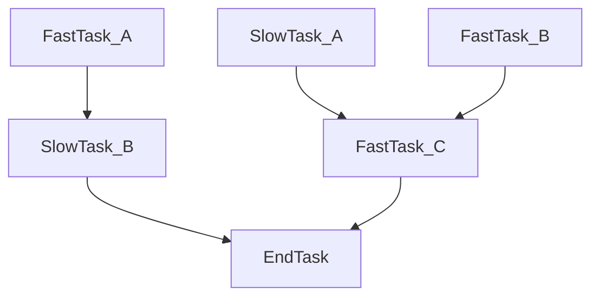

async-dag
---
[](https://pypi.org/project/async-dag/)
[](https://github.com/nhruo123/async-dag/actions)


A simple library for running complex DAG of async tasks while ensuring maximum possible parallelism.

### Use case and example

Lets assume that you have the following task dependencies graph (each task is an async function that could take time to resolve, and some tasks may depends on each other):


A naive way to write something like this would be:
```python
await end_task(await slow_task_b(await fast_task_a()), await fast_task_c(await slow_task_a(), await fast_task_b()))
```
But that would be bad because we will miss a lot of opportunities to run tasks in parallel.

A better version would be:
```python
fast_task_a_res, slow_task_a_res, fast_task_b_res = await asyncio.gather(fast_task_a(), slow_task_a(), fast_task_b())
await end_task(await slow_task_b(fast_task_a_res), await fast_task_c(slow_task_a_res, fast_task_b_res))
```
Where we run `fast_task_a_res`, `slow_task_a_res`, and `fast_task_b_res` in parallel.
but this is still suboptimal because we can start executing either `slow_task_b` once `fast_task_a` ends or `fast_task_c` once both `slow_task_a` and `fast_task_b`.

The optimal way to run this flow would be:
```python
async def _left_branch():
    return await slow_task_b(await fast_task_a())

async def _right_branch():
    slow_task_a_res, fast_task_b_res = await asyncio.gather(
        slow_task_a(), fast_task_b()
    )

    return await fast_task_c(slow_task_a_res, fast_task_b_res)

async def _end_node():
    left_branch_res, right_branch_res = await asyncio.gather(
        _left_branch(), _right_branch()
    )

    return await end_task(left_branch_res, right_branch_res)

await _end_node()
```
Which is very cumbersome and error prone to write by hand.


Using `async_dag` you can just write:
```python
from async_dag import build_dag

# Define your DAG
with build_dag() as tm:
    fast_task_a_node = tm.add_node(fast_task_a)
    slow_task_b_node = tm.add_node(slow_task_b, fast_task_a_node)

    slow_task_a_node = tm.add_node(slow_task_a)
    fast_task_b_node = tm.add_node(fast_task_b)
    fast_task_c_node = tm.add_node(fast_task_c, slow_task_a_node, fast_task_b_node)

    end_task_node = tm.add_node(end_task, slow_task_b_node, fast_task_c_node)

# Execute your DAG
execution_result = await tm.invoke(None) 

# Extract the return value of `end_task`
end_task_result = end_task_node.extract_result(execution_result)
```
And enjoy from maximum parallelism without the hassle.


### Docs and more examples
We use Docstring in order to describe our API, the main concepts you need to know are:
1. The [TaskManager](https://github.com/nhruo123/async-dag/blob/main/src/async_dag/task_manager.py) class.
2. The [add_node](https://github.com/nhruo123/async-dag/blob/main/src/async_dag/task_manager.py) method on `TaskManager`.
3. The [parameter_node](https://github.com/nhruo123/async-dag/blob/main/src/async_dag/task_manager.py) property of `TaskManager`.
4. The [sort](https://github.com/nhruo123/async-dag/blob/main/src/async_dag/task_manager.py) method of `TaskManager`.
5. The [invoke](https://github.com/nhruo123/async-dag/blob/main/src/async_dag/task_manager.py) method of `TaskManager`.
6. The [extract_result](https://github.com/nhruo123/async-dag/blob/main/src/async_dag/task_node.py) method of `TaskNode`.
7. The [build_dag](https://github.com/nhruo123/async-dag/blob/main/src/async_dag/task_manager.py) helper function.


For a full example take a look at [examples/readme.py](https://github.com/nhruo123/async-dag/blob/main/examples/readme.py).
