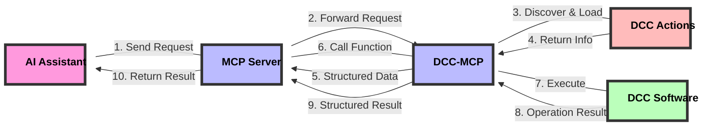

# dcc-mcp-core

[](https://www.python.org/)
[](https://opensource.org/licenses/MIT)
[](http://makeapullrequest.com)
[](https://github.com/loonghao/dcc-mcp-core/actions)

[中文文档](README_zh.md) | [English](README.md)

Foundational library for the DCC Model Context Protocol (MCP) ecosystem. It provides common utilities, base classes, and shared functionality that are used across all other DCC-MCP packages.

> **Note**: This project is in early development stage. The API may change at any time without prior notice.

## Design Philosophy and Workflow

DCC-MCP-Core is an action management system designed for Digital Content Creation (DCC) applications, aiming to provide a unified interface that allows AI to interact with various DCC software (such as Maya, Blender, Houdini, etc.).

### Core Workflow

1. **MCP Server**: Acts as a central coordinator, receiving requests from AI
2. **DCC-MCP**: Connects the MCP server and specific DCC software
3. **Action Discovery and Loading**: DCC-MCP-Core is responsible for discovering, loading, and managing actions
4. **Structured Information Return**: Returns action information in an AI-friendly structured format to the MCP server
5. **Function Calls and Result Return**: MCP server calls the corresponding action functions and returns the results to AI



### Action Design

Actions use a simple and intuitive design, allowing developers to easily create new DCC functionality:

- **Metadata Declaration**: Define basic action information through simple variables
- **Function Definition**: Implement specific DCC operation functionality
- **Context Passing**: Access DCC software's remote interface through the context parameter
- **Structured Return**: All functions return standardized structured data

### Remote Call Architecture

DCC-MCP-Core uses RPyC to implement remote procedure calls, allowing DCC operations to be executed in different processes or even on different machines:

- **Context Object**: Contains remote DCC client and command interface
- **Transparent Access**: Action code can access remote DCC APIs as if they were local
- **Error Handling**: Unified error handling mechanism ensures stable operation

## Package Structure

DCC-MCP-Core is organized into several subpackages:

- **actions**: Action management and generation
  - `generator.py`: Generates action templates
  - `manager.py`: Manages action discovery and loading
  - `metadata.py`: Defines action metadata structures

- **models**: Data models for the MCP ecosystem
  - `action_result.py`: Structured result model for actions

- **parameters**: Parameter handling and validation
  - `groups.py`: Parameter grouping and dependencies
  - `models.py`: Parameter data models
  - `processor.py`: Parameter processing utilities
  - `validation.py`: Parameter validation logic

- **templates**: Template handling
  - `utils.py`: Template rendering with Jinja2

- **utils**: Utility functions and helpers
  - `constants.py`: Common constants
  - `decorators.py`: Function decorators for error handling and result formatting
  - `exceptions.py`: Exception hierarchy
  - `platform.py`: Platform-specific utilities
  - `template.py`: Template utilities

## Features

- Parameter processing and validation
- Standardized logging system
- Common exception hierarchy
- Utility functions for DCC integration
- Version compatibility checking
- Action management system for DCC-specific functionality
- AI-friendly structured data interfaces
- Remote procedure call support via RPyC

## Installation

```bash
pip install dcc-mcp-core
```

## Development Setup

```bash
# Clone the repository
git clone https://github.com/loonghao/dcc-mcp-core.git
cd dcc-mcp-core

# Create and activate virtual environment
python -m venv venv
source venv/bin/activate  # On Windows: venv\Scripts\activate

# Install development dependencies
pip install -e .
pip install pytest pytest-cov pytest-mock pyfakefs
```

## Running Tests

```bash
# Run tests with coverage
uvx nox -s pytest

# Run specific tests
python -m pytest tests/test_action_manager.py -v
```

## Example Usage

### Discovering and Loading Actions

```python
from dcc_mcp_core.actions.manager import ActionManager

# Create an action manager for Maya
manager = ActionManager('maya')

# Discover available actions
actions_info = manager.get_actions_info()

# Print information about available actions
for name, info in actions_info.items():
    print(f"Action: {name}")
    print(f"  Version: {info['version']}")
    print(f"  Description: {info['description']}")
    print(f"  Functions: {len(info['functions'])}")

# Load a specific action
result = manager.load_action('/path/to/my_action.py')
if result.success:
    print(f"Loaded action: {result.context['action_name']}")
else:
    print(f"Failed to load action: {result.error}")

# Call a function from an action
result = manager.call_action_function('my_action', 'create_sphere', radius=2.0)
if result.success:
    print(f"Success: {result.message}")
    print(f"Created object: {result.context['object_name']}")
else:
    print(f"Error: {result.error}")
```

### Creating a Custom Action

```python
# my_maya_action.py
__action_name__ = "my_maya_action"
__action_version__ = "1.0.0"
__action_description__ = "Custom Maya operations"
__action_author__ = "Your Name"

from dcc_mcp_core.models import ActionResultModel

def create_sphere(context, radius=1.0, name="sphere"):
    """Create a sphere in Maya.

    Args:
        context: The DCC context object
        radius: The radius of the sphere
        name: The name of the sphere

    Returns:
        ActionResultModel with the result information
    """
    try:
        # Execute Maya command through the context
        sphere_name = context.cmds.sphere(radius=radius, name=name)[0]

        return ActionResultModel(
            success=True,
            message=f"Successfully created sphere '{sphere_name}'",
            prompt="You can now modify the sphere's properties or create more objects",
            context={
                'object_name': sphere_name,
                'object_type': 'sphere',
                'properties': {'radius': radius}
            }
        )
    except Exception as e:
        return ActionResultModel(
            success=False,
            message="Failed to create sphere",
            error=str(e)
        )
```

## Contributing

Contributions are welcome! Please feel free to submit a Pull Request.

## License

This project is licensed under the MIT License - see the LICENSE file for details.
