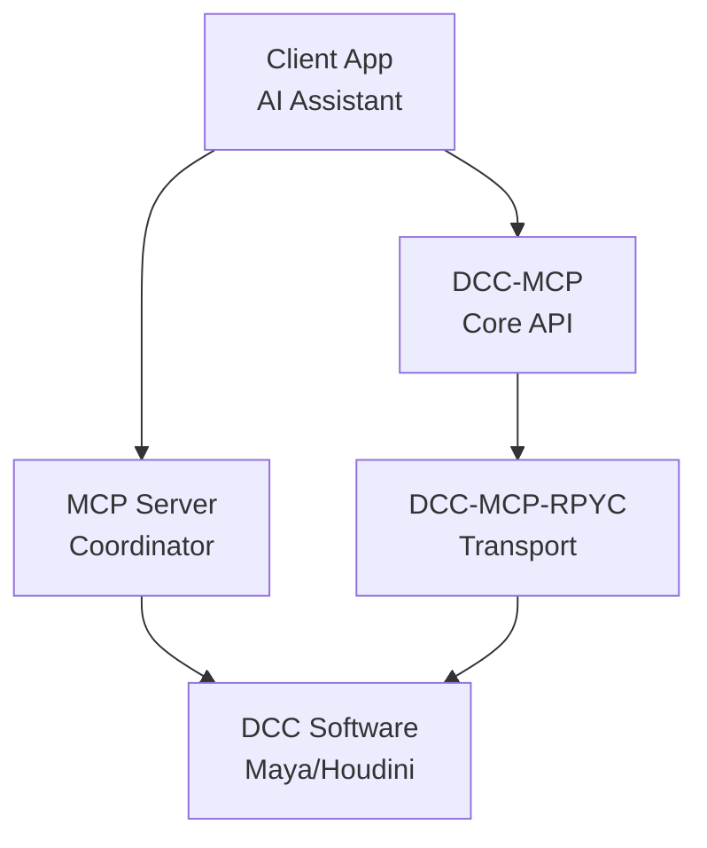

# DCC-MCP-RPYC

<div align="center">
    

[](https://badge.fury.io/py/dcc-mcp-rpyc)
[](https://github.com/loonghao/dcc-mcp-rpyc/actions)
[](https://pypi.org/project/dcc-mcp-rpyc/)
[](https://github.com/loonghao/dcc-mcp-rpyc/blob/main/LICENSE)
[](https://github.com/psf/black)
[](https://github.com/astral-sh/ruff)
[](https://pepy.tech/project/dcc-mcp-rpyc)
</div>

[English](README.md) | [中文](README_zh.md)

RPyC implementation for DCC software integration with Model Context Protocol (MCP). This package provides a framework for exposing DCC functionality via RPYC, allowing for remote control of DCC applications.

## Why RPyC?

RPyC (Remote Python Call) offers significant advantages for DCC software integration:

- **Dynamic Interface Exposure**: RPyC dynamically exposes interfaces within DCC applications, reducing development effort by eliminating the need to create static API wrappers.
- **Native API Access**: Enables direct use of native DCC APIs like Maya's `cmds`/`pymel`, Houdini's `hou`, Blender's `bpy`, and Nuke's Python API without translation layers.
- **Transparent Remote Execution**: Code written for local execution can run remotely with minimal changes, preserving the developer experience.
- **Reduced Boilerplate**: Minimizes repetitive code needed for inter-process communication compared to other IPC methods.
- **Object References**: Maintains live references to remote objects, allowing for natural object-oriented programming across process boundaries.

By leveraging RPyC, DCC-MCP-RPYC provides a unified framework that preserves the native feel of each DCC's API while enabling remote control capabilities.

## Features

- Thread-safe RPYC server implementation for DCC applications
- Service discovery for finding DCC services on the network
- Abstract base classes for creating DCC-specific adapters and services
- Support for multiple DCC applications (Maya, Houdini, 3ds Max, Nuke, etc.)
- Integration with the Model Context Protocol (MCP) for AI-driven DCC control

## Architecture

The architecture of DCC-MCP-RPYC is designed to provide a unified interface for controlling various DCC applications:



Key components:

- **DCCServer**: Manages the RPYC server within the DCC application
- **DCCRPyCService**: Base class for services that expose DCC functionality via RPYC
- **BaseDCCClient**: Client-side interface for connecting to and controlling DCC applications
- **DCCAdapter**: Abstract base class for DCC-specific adapters
- **ConnectionPool**: Manages and reuses connections to DCC servers

## Installation

```bash
pip install dcc-mcp-rpyc
```

Or with Poetry:

```bash
poetry add dcc-mcp-rpyc
```

## Usage

### Server-side (within DCC application)

```python
# Create and start a DCC server in Maya
from dcc_mcp_rpyc.server import create_dcc_server, DCCRPyCService

# Create a custom service class
class MayaService(DCCRPyCService):
    def get_scene_info(self):
        # Implement Maya-specific scene info retrieval
        return {"scene": "Maya scene info"}

    def exposed_execute_cmd(self, cmd_name, *args, **kwargs):
        # Implement Maya command execution
        pass

# Create and start the server
server = create_dcc_server(
    dcc_name="maya",
    service_class=MayaService,
    port=18812  # Optional, will use random port if not specified
)

# Start the server (threaded=True to avoid blocking Maya's main thread)
server.start(threaded=True)
```

### Client-side

```python
from dcc_mcp_rpyc.client import BaseDCCClient

# Connect to a DCC server
client = BaseDCCClient(
    dcc_name="maya",
    host="localhost",
    port=18812  # Optional, will discover automatically if not specified
)

# Connect to the server
client.connect()

# Call a remote method
result = client.call("execute_cmd", "sphere", radius=5)
print(result)

# Get scene information
scene_info = client.call("get_scene_info")
print(scene_info)

# Disconnect when done
client.disconnect()
```

### Using Connection Pool

```python
from dcc_mcp_rpyc.client import ConnectionPool

# Create a connection pool
pool = ConnectionPool()

# Get a client from the pool (creates a new connection if needed)
with pool.get_client("maya", host="localhost") as client:
    # Call methods on the client
    result = client.call("execute_cmd", "sphere", radius=5)
    print(result)

# Connection is automatically returned to the pool
```

### Creating a DCC Adapter

```python
from dcc_mcp_rpyc.dcc_adapter import DCCAdapter
from dcc_mcp_rpyc.client import BaseDCCClient

class MayaAdapter(DCCAdapter):
    def _create_client(self) -> BaseDCCClient:
        return BaseDCCClient(
            dcc_name="maya",
            host=self.host,
            port=self.port,
            timeout=self.timeout
        )

    def create_sphere(self, radius=1.0):
        self.ensure_connected()
        return self.dcc_client.call("execute_cmd", "sphere", r=radius)
```

## Development

### Setup

```bash
# Clone the repository
git clone https://github.com/loonghao/dcc-mcp-rpyc.git
cd dcc-mcp-rpyc

# Install dependencies with Poetry
poetry install
```

### Testing

```bash
# Run tests with nox
nox -s pytest

# Run linting
nox -s lint

# Fix linting issues
nox -s lint_fix
```

## License

MIT
