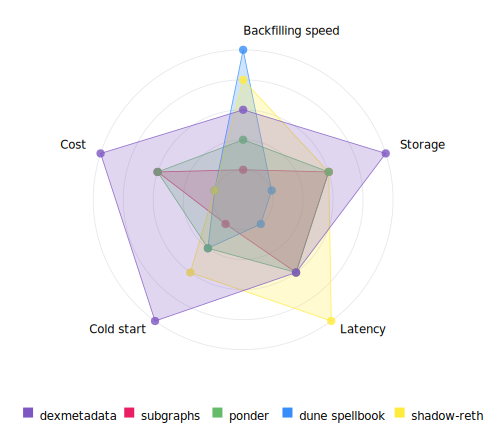

<h1>
<p align="center">
  <br>DexMetadata 🦄 
</p >
</h1>

<p align="center">
Python library for fetching metadata from DEX pools
</p>

<div align="center">
  <a href="#usage">Usage</a> •
  <a href="#features">Features</a> •
  <a href="#installation">Installation</a> •
  <a href="#how-it-works">How It Works</a> •
  <a href="#performance">Performance</a> •
  <a href="#overview">Metadata Retrieval Methods</a> •
  <a href="#cli-options">CLI Options</a> •
  <a href="#coverage">Protocol Coverage</a> •
  <a href="#roadmap">Roadmap</a>
  
</div>

<p align="center">
  <a href="https://pypi.org/project/dexmetadata">
    
  </a>
  <a href="https://opensource.org/licenses/MIT">
    
  </a>
</p>


<h2 id="usage">Usage 🚀</h2>

```python
from dexmetadata import fetch

POOL_ADDRESSES = [
    "0xfBB6Eed8e7aa03B138556eeDaF5D271A5E1e43ef",  # cbBTC/USDC on uniswap v3
    "0x31f609019d0CC0b8cC865656142d6FeD69853689",  # POPCAT/WETH on uniswap v2
    "0x6cDcb1C4A4D1C3C6d054b27AC5B77e89eAFb971d",  # AERO/USDC on Aerodrome
    "0x323b43332F97B1852D8567a08B1E8ed67d25A8d5",  # msETH/WETH on Pancake Swap
    # Add hundreds more without worry!
]

pools = fetch(
    POOL_ADDRESSES, 
    rpc_url="https://base-rpc.publicnode.com",
    batch_size=30,
    max_concurrent_batches=25,
)

assert pools[0].token0.symbol == 'USDC'

assert pools[0].token1.name == 'Coinbase Wrapped BTC'
assert pools[0].token1.symbol == 'cbBTC'
assert pools[0].token1.address == '0xcbb7c0000ab88b473b1f5afd9ef808440eed33bf'
assert pools[0].token1.decimals == 8
```
**CLI:**
```bash
# Fetch
dex fetch 0xfBB6Eed8e7aa03B138556eeDaF5D271A5E1e43ef --network base

# Cache
dex cache-info
dex cache-clear

# protocol coverage
dex coverage

# Optimize
dex optimize --rpm 1800 --rpc https://base-rpc.publicnode.com
```

<h2 id="features">Features 🌟</h2>

- No fancy setup ([dbt pipelines](https://github.com/duneanalytics/spellbook/tree/main/dbt_subprojects/dex/models/trades) / datalake infrastructure / [customized nodes](https://github.com/shadow-hq/shadow-reth)) needed, just plug in any standard RPC and you're good to go
- Uses some clever EVM tricks (assembly optimized [deployless multicall](https://destiner.io/blog/post/deployless-multicall/)) to get the job done quickly and cheaply
- Covers 95%+ of swaps out there without DEX-specific custom transform logic
- Processes multiple pools at once to keep things fast and efficient
- [Handy tool](examples/optimize.py) to automatically find good settings for your RPC
- Persistent caching with hybrid LRU/LFU eviction policy for frequently queried pools
- Python and CLI interface


<h2 id="installation">Installation 📥</h2>

```bash
$ uv add dexmetadata
```

<h2 id="how-it-works">How It Works 🔍</h2>

1. On each eth_call we "deploy" a [special contract](src/dexmetadata/contracts/PoolMetadataFetcher.sol) using the [deployless multicall](https://destiner.io/blog/post/deployless-multicall/) trick 
2. Contract executes with a batch of pool addresses in the EVM and fetches both tokens in each pool
3. Then for each token we get token name, symbol, and decimals using optimized assembly calls
4. The result is decoded in Python and returned as a list of dictionaries
5. For async execution, multiple batches are processed concurrently using asyncio

<details>
  <summary>Visual summary of the flow</summary>
  
  ```mermaid
  graph TD
      A["Pools"]:::python --> B{{"🔍 Validate<br> addresses"}}:::python
      B -->|"✅"| C["📦 Batches"]:::python
      B -->|"❌"| D["⚠ Log Warning"]:::python
      C -->|"⚡ Concurrent"| EVM1
      EVM1["🌐 RPC eth_call"]:::python
      EVM1 -->|"batch"| F

      subgraph EVM ["Node"]
          F["📄 Deployless multicall <br>contract constructor"]:::python
          G["Process Pool"]:::python
          H{{" Has <br> token0/token1?"}}:::python
          I["⚙ Assembly Calls"]:::python
          J["🔄 Null Data"]:::python
          K["Encode Metadata"]:::python
          L["Return ABI Data"]:::python

          %% Internal flow inside EVM subgraph
          F -->|"loop"| G
          G --> H
          H -->|"✅ Yes (97.5%)"| I
          H -->|"❌ ex Uniswap v4 (2.5%)"| J
          I --> K
          K --> L
      end
      L --> M
      M["Decoder"]:::python
      M --> N
      N["Pool Objects"]:::python

      %% Observed error paths from logs
      EVM1 -.->|"404 Not Found"| D
      I -.->|"ex Uniswap v4"| J

      %% Class definitions for styling (minimalistic palette)
      classDef python fill:#f5f5f5,stroke:#ccc,color:#333,stroke-width:1px;
      classDef validation fill:#f5f5f5,stroke:#ccc,color:#333,stroke-width:1px;
      classDef batch fill:#f5f5f5,stroke:#ccc,color:#333,stroke-width:1px;
      classDef rpc fill:#f5f5f5,stroke:#ccc,color:#333,stroke-width:1px;
      classDef contract fill:#f5f5f5,stroke:#ccc,color:#333,stroke-width:1px;
      classDef assembly fill:#f5f5f5,stroke:#ccc,color:#333,stroke-width:1px;
      classDef error fill:#ffcccc,stroke:#e57373,color:#333,stroke-width:1px;
      classDef success fill:#ccffcc,stroke:#81c784,color:#333,stroke-width:1px;
  ```
</details>


<h2 id="performance">Performance ⚡️</h2>

Using a provider like Alchemy you can reach around 2000 pools/s of throughput (`batch_size=30`, `max_concurrent_batches=200`), own node can go way higher. At 2000 pools/s you can retrieve metadata for all Ethereum pools active in the past year in ~1 minute.

<h2 id="overview">Overview of pool metadata retrieval methods 📚</h2>

### Metadata origin

DEX **pool metadata** (token addresses) can be retrieved from:

- **Event Logs** (ex `PairCreated`/`PoolCreated` events)
- **Contract Storage** (ex accessed via `.token0()` / `.token1()`)
- **Transaction input data:** (ex `createPair/createPool` tx calldata)

**ERC20 metadata** is stored in **Contract Storage** and can be accessed via the corresponding view functions (`.name()`, `.symbol()`, `.decimals()`)

### Methods to access pool and ERC20 metadata:

- Direct node access (ex reth execution extensions or direct db access)
- RPC calls
- Pre-indexed raw tables (e.g., envio.dev, sqd.ai)

### Processing

We also need processing for:

- Filtering
- Decoding logs
- Combining pool and ERC20 metadata
- Caching

Processing can be performed on-node, off-chain, or hybrid, creating several dimensions in the **solution space**, in summary:

- **Data Origin**: Raw Logs, Transaction Inputs, Contract State
-  **Access Method**: Direct Node, RPC, Indexer
- **Processing Location**: On-Node, Off-Chain, Hybrid

### Solution space

| **solution**       | **Processing** | **Origin**     | **Access Method** |
| ------------------ | --------------- | -------------- | ----------------- |
| **subgraphs**      | Off-Chain       | Raw Logs       | RPC               |
| **dune spellbook** | Off-Chain       | Raw Logs       | Indexer           |
| **shadow-reth**    | On-Node         | Contract State | Direct Node       |
| **ponder**         | Off-Chain       | Hybrid         | RPC               |

Each example approach has a unique complexity, storage, latency profile. Relevant metrics include:

- **DEX Coverage**: Effort needed to add new DEXes
- **Backfill Speed**: Performance of processing a large number of pools
- **Storage**: Ex space required for indexed data
- **Latency**: Delay from transaction inclusion to data availability
- **Cold Start**: Time needed to start serving requests
- **Complexity**: Implementation and maintenance effort
- **Cost**: Operational expenses

This chart provides a view on how these approaches compare with each other (higher = better). The scores reflect subjective estimates of each methodology in the context of the task of fetching metadata for a specific set of pools (rather than the actual products themselves)




### This library's approach

- **Metadata Origin:** Contract State
- **Access Method:** RPC
- **Processing:** mostly on-node with the deployless multicall contract

**Pros:**

- Minimal setup: just a Python library and standard RPC
- Strong DEX coverage (over 95%) without the need for custom logic for each individual DEX
- Storage efficient: eliminates the requirement for maintaining large historical tables for every pool and token, which users are unlikely to query
- More performant than solutions that process events one at a time
- Smart caching reduces RPC calls for frequently queried pools

**Cons**

- Backfills (more precisely large number of pools) can be slower compared to using event logs and indexers, as it does not take advantage of pre-indexed data, also off-chain processing scales better than on-node solutions
- Slightly higher latency in comparison to direct node access methods

<h2 id="cli-options">CLI Options 💻</h2>

- `fetch`: Retrieve pool metadata
  - `--network`: Blockchain network (default: base)
  - `--rpc-url`: Custom RPC URL
  - `--output`, `-o`: Output file path (format auto-detected from extension: .json, .csv)
  - `--format`: Override auto-detected output format (text, json, csv)
  - `--batch-size`: Number of pools to fetch in a single batch (default: 30)
  - `--max-concurrent-batches`: Maximum number of concurrent batch requests (default: 25)
  - `--no-progress`: Disable progress bar
  - Cache options:
    - `--no-cache`: Disable caching
    - `--cache-persist`: Enable cache persistence to disk
    - `--cache-max-pools`: Maximum number of pools to cache (default: 10000)

- `cache-info`: Display cache statistics
  - Shows cache directory, database size, number of entries, usage percentage
  - Lists most frequently accessed pools

- `cache-clear`: Clear the cache entirely

- `optimize`: Find optimal parameters for fetching pool metadata
  - `--rpc-url`: RPC URL to test (default: https://base-rpc.publicnode.com)
  - `--rpm`: Rate limit in requests per minute
  - `--rps`: Rate limit in requests per second
  - `--batch-size`: Specify a batch size instead of testing
  - `--concurrency`: Force specific concurrency value (override calculated value)

<h2 id="coverage">Protocol coverage 📡</h2>

Protocol Coverage  
| Chain    | Coverage % | protocols |
|----------|------------|-------|
| bnb      |      99.2% | 12/19 |
| arbitrum |      97.1% | 10/17 |
| base     |      95.9% | 16/25 |
| optimism |      94.2% |  9/13 |
| ethereum |      89.3% |  6/23 |
| polygon  |       0.1% |  0/14 |

<details>
<summary>Failure Rates by Protocol </summary>

| Protocol                             | Chain    | Failure Rate |
|--------------------------------------|----------|--------------|
| trader_joe_2.1                       | arbitrum |        1.0%  |
| balancer_2                           | arbitrum |        0.7%  |
| maverick_2                           | arbitrum |        0.4%  |
| swaap_2                              | arbitrum |        0.3%  |
| trader_joe_2.2                       | arbitrum |        0.3%  |
| dodo_2                               | arbitrum |        0.3%  |
| dodo_1                               | arbitrum |        0.1%  |
| maverick_2                           | base     |        1.7%  |
| maverick_1                           | base     |        0.7%  |
| swaap_2                              | base     |        0.6%  |
| balancer_2                           | base     |        0.4%  |
| openocean_2                          | base     |        0.3%  |
| balancer_3                           | base     |        0.2%  |
| clipper_1                            | base     |        0.1%  |
| woofi_2                              | base     |        0.1%  |
| 1inch-LOP_4                          | base     |        0.1%  |
| dodo_2                               | bnb      |        0.2%  |
| pancakeswap_stableswap               | bnb      |        0.2%  |
| maverick_2                           | bnb      |        0.1%  |
| 1inch-LOP_4                          | bnb      |        0.1%  |
| maverick_1                           | bnb      |        0.1%  |
| swaap_2                              | bnb      |        0.0%  |
| airswap_swap_erc20_v4                | bnb      |        0.0%  |
| balancer_2                           | ethereum |        1.5%  |
| fluid_1                              | ethereum |        1.5%  |
| curve_Regular                        | ethereum |        1.3%  |
| curve_Factory V2 updated             | ethereum |        1.3%  |
| curve_Factory V1 Stableswap Plain    | ethereum |        1.0%  |
| 1inch-LOP_4                          | ethereum |        0.5%  |
| balancer_1                           | ethereum |        0.5%  |
| maverick_2                           | ethereum |        0.5%  |
| bancor_1                             | ethereum |        0.5%  |
| curve_Factory V1 Stableswap Plain NG | ethereum |        0.3%  |
| dodo_2                               | ethereum |        0.3%  |
| uniswap_1                            | ethereum |        0.3%  |
| 0x-API_v4                            | ethereum |        0.3%  |
| curve_Factory V1 Meta                | ethereum |        0.3%  |
| clipper_4                            | ethereum |        0.3%  |
| curve_Factory V1 Plain               | ethereum |        0.3%  |
| balancer_2                           | optimism |        3.2%  |
| woofi_1                              | optimism |        1.4%  |
| curve_1                              | optimism |        0.9%  |
| swaap_2                              | optimism |        0.2%  |
| quickswap_2                          | polygon  |       30.9%  |
| quickswap_3                          | polygon  |       15.5%  |
| balancer_2                           | polygon  |        3.5%  |
| dodo_2                               | polygon  |        0.4%  |
| dfyn_1                               | polygon  |        0.4%  |
| kyberswap_classic                    | polygon  |        0.1%  |
| honeyswap_2                          | polygon  |        0.1%  |
| dodo_1                               | polygon  |        0.1%  |
| swaap_2                              | polygon  |        0.1%  |
</details>

<h2 id="roadmap">Roadmap 🚧</h2>

- [x] Cache with least recently used eviction policy
- [x] CLI interface
- [ ] DEX support
    - [x] uniswap v4
    - [ ] quickswap_2
- [ ] erpc integration
- [ ] benchmarks
- [ ] alternative method to leverage indexed data and off-chain processing for requests involving a higher number of pools