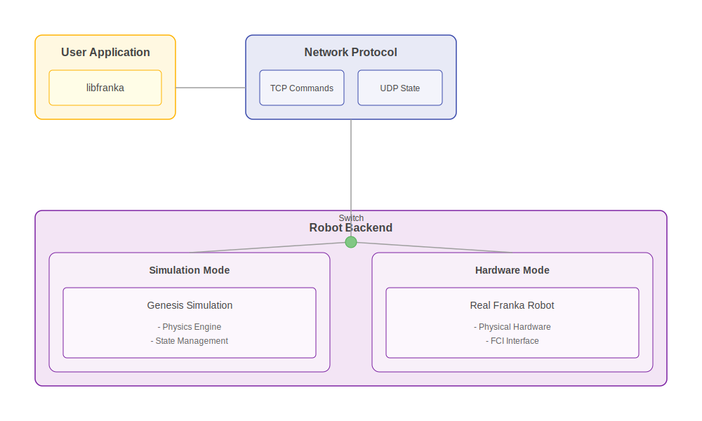

# Franka Simulation Server

A high-fidelity Genesis simulation server that communicates with the Franka robot's network protocol, enabling seamless switching between simulation and hardware.

## Overview

The Franka Simulation Server provides a drop-in replacement for the real Franka robot, implementing the complete libfranka network protocol. This allows developers to:

- Test and debug robot controllers in simulation before deployment
- Develop applications that work identically on both simulation and hardware
- Validate error handling and safety features
- Experiment with different control strategies risk-free

## Related Projects

- [libfranka-python](https://github.com/BarisYazici/libfranka-python) - Python bindings for libfranka
- [franka-gym](https://github.com/BarisYazici/franka-gym) - Franka gym implementation

## Preview Video

- Native libfranka control


- With Python


## Architecture



In this repository, we only provide the simulation server backend with Genesis connection.

The libfranka python bindings will become available in a separate repository.

The system consists of several key components:

1. **libfranka Interface Layer**
   - Implements the standard Franka robot network protocol
   - Handles TCP command interface and UDP state updates
   - Maintains protocol compatibility all libfranka versions

2. **Genesis Simulation Backend**
   - Physics-based robot simulation using the Genesis engine
   - Real-time joint state computation and dynamics

3. **State Management**
   - Complete robot state tracking and synchronization
   - Accurate error reporting and status updates
   - Real-time state transmission (1kHz update rate)

4. **Control Modes**
   - Joint Position Control
   - Joint Velocity Control
   - Joint Torque Control
   - Supports seamless switching between modes

## Key Features

- **Protocol Compatibility**: Full implementation of the Franka robot network protocol
- **Real-time Simulation**: High-frequency state updates and control (1kHz)
- **Multiple Control Modes**: Supports position, velocity, and torque control
- **Error Handling**: Replicates real robot error states and recovery

## Getting Started

### Prerequisites
- Python 3.9+
- genesis-world
- numpy
- numba

### Installation

#### Option 1: Install from PyPI (Recommended)

The package is available on PyPI and can be installed with pip:

```bash
pip install franka-sim
```

#### Option 2: Install from Source

```bash
# Clone the repository
git clone git@github.com:BarisYazici/libfranka-sim.git

# Install the package
cd libfranka-sim/simulation
pip install -e .
```

### Basic Usage

After installation, you can run the server using the command-line executable:

```bash
# Start the server without visualization
run-franka-sim-server

# Start the server with visualization
run-franka-sim-server -v
```

Alternatively, if you installed from source, you can use:

```bash
# Start the simulation server
python -m franka_sim.run_server -v
```

In your application, use standard libfranka commands. The simulation will respond exactly like the real robot.

## Configuration

## Switching Between Simulation and Hardware

To switch between simulation and hardware:

1. Update the robot IP address in your application:
   - Use `localhost` or `127.0.0.1` for simulation
   - Use the real robot's IP for hardware

2. No other changes needed - your application code remains identical

## Development Status

The simulation server currently implements all major features of the Franka robot:

- [x] Complete network protocol implementation
- [x] All joint interfaces
- [x] Real-time state updates
- [x] Visualization support
- [x] Genesis connection
- [x] libfranka python bindings
- [ ] Advanced collision detection (in progress)
- [ ] Error handling and recovery (planned)
- [ ] Cartesian interfaces (planned)
- [ ] Return mass, coriolis, gravity, and inverse dynamics (Robot models) (planned)
- [ ] Gripper simulation (planned)


## Contributing

Contributions are welcome! Please read our contributing guidelines and submit pull requests to our repository.

## License

This project is licensed under the Apache License Version 2.0 - see the LICENSE file for details.

## Acknowledgments

- Franka Robotics GmbH for the original libfranka implementation
- The Genesis Simulator team for the physics engine
