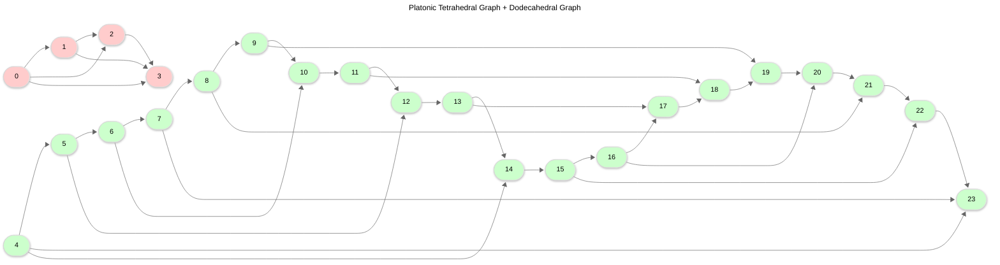

# networkx-mermaid

Create a Mermaid graph from a NetworkX graph

[](https://codecov.io/gh/erivlis/networkx-mermaid)
[](https://app.codacy.com/gh/erivlis/networkx-mermaid/dashboard?utm_source=gh&utm_medium=referral&utm_content=&utm_campaign=Badge_coverage)
[](https://app.codacy.com/gh/erivlis/networkx-mermaid?utm_source=github.com&utm_medium=referral&utm_content=erivlis/networkx-mermaid&utm_campaign=Badge_Grade)
[](https://www.codefactor.io/repository/github/erivlis/networkx-mermaid)
[](https://scrutinizer-ci.com/g/erivlis/networkx-mermaid/?branch=main)

[](https://sonarcloud.io/summary/new_code?id=erivlis_networkx-mermaid)
[](https://sonarcloud.io/summary/new_code?id=erivlis_networkx-mermaid)
[](https://sonarcloud.io/summary/new_code?id=erivlis_networkx-mermaid)
[](https://sonarcloud.io/summary/new_code?id=erivlis_networkx-mermaid)

[](https://snyk.io/test/github/erivlis/networkx-mermaid)

## Example

```python title="Create a Mermaid Diagram from a NetworkX Graph"
import threading
import webbrowser
from tempfile import TemporaryDirectory

import networkx as nx

from networkx_mermaid import DiagramOrientation, DiagramNodeShape
from networkx_mermaid.builders import DiagramBuilder
from networkx_mermaid.formatters import html, markdown
from networkx_mermaid.typing import MermaidDiagram


# An example of a graph with multiple components
def create_graph():
    pastel_colors = ["#FFCCCC", "#CCFFCC", "#CCCCFF", "#FFFFCC", "#CCFFFF", "#FFCCFF"]
    graphs: list[nx.Graph] = [nx.tetrahedral_graph(), nx.dodecahedral_graph()]

    for i, g in enumerate(graphs):
        nx.set_node_attributes(g, {n: {"color": pastel_colors[i]} for n in g.nodes})

    graph: nx.Graph = nx.disjoint_union_all(graphs)

    graph.name = " + ".join(g.name for g in graphs)

    return graph


def create_builder():
    # Create a Mermaid Diagram Builder with custom settings

    builder = DiagramBuilder(
        orientation=DiagramOrientation.LEFT_RIGHT,
        node_shape=DiagramNodeShape.ROUND_RECTANGLE,
    )
    return builder


def create_server(port: int, root_directory: str, open_browser: bool = True) -> threading.Thread:
    import http.server
    import socketserver

    url = f"http://localhost:{port}"

    class Handler(http.server.SimpleHTTPRequestHandler):
        def __init__(self, *args, **kwargs):
            super().__init__(*args, directory=root_directory, **kwargs)

    def serve():
        with socketserver.TCPServer(('', port), Handler) as httpd:
            print("Serving at:", url)
            httpd.serve_forever()

    server_thread = threading.Thread(target=serve)
    server_thread.daemon = True
    server_thread.start()

    if open_browser:
        webbrowser.open(url)


def main():
    graph = create_graph()
    builder = create_builder()

    # Build the Mermaid Diagram
    mermaid_diagram: MermaidDiagram = builder.build(graph)

    # Format the Mermaid Diagram for Markdown embedding
    markdown_diagram: str = markdown(mermaid_diagram)

    # or as single page HTML
    html_diagram: str = html(mermaid_diagram, title=graph.name)

    print('Mermaid Diagram:')
    print(mermaid_diagram)
    print(markdown_diagram)
    print(html_diagram)

    ## Save the HTML diagram to a file and serve it
    with TemporaryDirectory() as temp_dir:
        with open(f"{temp_dir}/index.html", 'w') as f:
            f.write(html_diagram)

        # Serve the HTML diagram
        create_server(port=8073, root_directory=temp_dir, open_browser=True)

        # Keep the main thread alive to allow the server to run
        try:
            while True:
                pass
        except KeyboardInterrupt:
            print("Server stopped")


if __name__ == "__main__":
    main()
```

## Diagram

