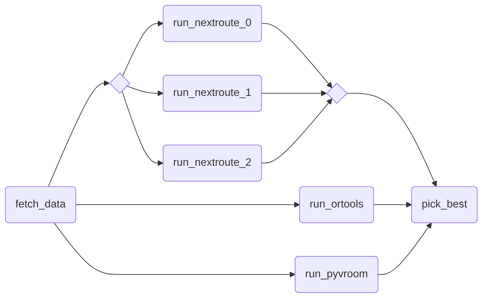

# Complex example

A more complex pipeline combining some concepts.

## Graph



## Pre-requisites

- Subscribe to the following marketplace apps and name them as follows:
  - _Nextmv Routing_: `routing-nextroute`
  - _OR-Tools Routing_: `routing-ortools`
  - _PyVroom Routing_: `routing-pyvroom`

## Usage

```bash
nextmv app push -a <app-id>
curl "https://gist.githubusercontent.com/merschformann/a90959b87d1360b604e4a9f6457340ca/raw/661e631376bdf78a07548a3cd136c1fc6e47c639/muenster.json" | nextmv app run -a <app-id>
```
