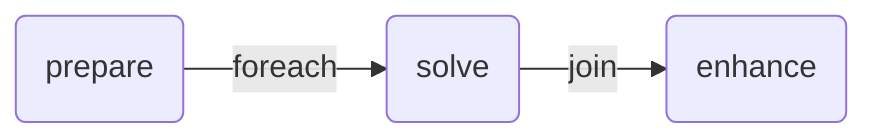

# Foreach fanout example

Example of a pipeline with a fanout step (`@foreach`) that runs the same input through a solve step with different app options.

## Graph



## Pre-requisites

- Push the echo app as described in the [echo app README](../apps/echo/README.md)

## Usage

```bash
nextmv app push -a <app-id>
echo '{}' | nextmv app run -a <app-id>
```
